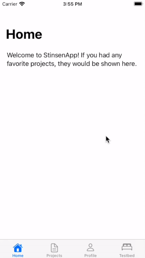

<p align="center">
  
</p>

[](https://swift.org)
[](https://apple.com)
[](https://github.com/rundfunk47/stinsen/blob/main/LICENSE)

Simple, powerful and elegant implementation of the Coordinator pattern in SwiftUI. Stinsen is written using 100% SwiftUI which makes it work seamlessly across iOS, tvOS, watchOS and macOS devices. The library is developed during working hours for the [Byva](https://www.byva.se) app.

# Why? 🤔

We all know routing in UIKit can be hard to do elegantly when working with applications of a larger size or when attempting to apply an architectural pattern such as MVVM. Unfortunately, SwiftUI out of the box suffers from many of the same problems as UIKit does: concepts such as `NavigationLink` live in the view-layer, we still have no clear concept of flows and routes, and so on. _Stinsen_ was created to alleviate these pains, and is an implementation of the _Coordinator Pattern_. Being written in SwiftUI, it is completely cross-platform and uses the native tools such as `@EnviromentObject`. The goal is to make _Stinsen_ feel like a missing tool in SwiftUI, conforming to its coding style and general principles.

# What is a Coordinator? 🤷🏽‍♂️ 

Normally in SwiftUI a view has to handle adding other views to the navigation stack using `NavigationLink`. What we have here is a tight coupling between the views, since the view must know in advance all the other views that it can navigate between. Also, the view is in violation of the _single-responsibility principle_ (SRP). Using the Coordinator Pattern, presented to the iOS community by Soroush Khanlou at the NSSpain conference in 2015, we can delegate this responsibility to a higher class: The Coordinator.

# How do I use Stinsen?  🧑🏼‍🏫  

Example using a Navigation Stack:

```swift
class ProjectsCoordinator: NavigationCoordinatable {
    var navigationStack = NavigationStack() // usually you would want to initialize this without any active children

    enum Route {
        case project(id: UUID)
        case createProject
    }
    
    func resolveRoute(route: Route) -> Transition {
        switch route {
        case .project(let id):
            return .push(AnyView(ProjectSummaryScreen(id: id)))
        case .createProject:
            return .modal(AnyCoordinatable(CreateProjectCoordinator()))
        }
    }
    
    @ViewBuilder func start() -> some View {
        ProjectsScreen()
    }
}
```

The `Route`-enum defines all the possible routes that can be performed from the current coordinator. The function `resolve(route: Route)` is responsible for providing the transition and the actual view/coordinator that we will route to. This can be combined with a factory in the coordinator as well.

To perform these transitions, we use `@EnviromentObject` to fetch a reference to the Coordinators context:

```swift
struct ProjectsScreen: View {
    @EnvironmentObject var projects: NavigationRouter<ProjectsCoordinator.Route>
    
    var body: some View {
        List {
          /* ... */
        }
        .navigationBarItems(
            trailing: Button(
                action: { projects.route(to: .createProject) },
                label: { Image(systemName: "doc.badge.plus") }
            )
        )
    }
}
```

You can also fetch references for coordinators that have appeared earlier in the tree, for instance, if you want to switch the tab. This `@EnvironmentObject` can be put into a ViewModel if you wish to follow the MVVM-C Architectural Pattern. 

Stinsen out of the box has three different kinds of `Coordinatable` protocols your coordinators can implement: 

* `NavigationCoordinatable` - For navigational flows. Make sure to wrap these in a NavigationViewCoordinator somewhere if you wish to push on the navigation stack.
* `TabCoordinatable` - For TabViews.
* `ViewCoordinatable` - Just a view and routes that do not push but rather replace the entire view, can be used for instance when switching between logged in/logged out.

# Installation 💾

_Stinsen_ supports two ways of installation, Cocoapods and SPM. 

## SPM

Open Xcode and your project, click `File / Swift Packages / Add package dependency...` .  In the textfield "_Enter package repository URL_", write `https://github.com/rundfunk47/stinsen` and press _Next_ twice

## Cocoapods

Create a `Podfile` in your app's root directory. Add
```
# Podfile
use_frameworks!

target 'YOUR_TARGET_NAME' do
    pod 'Stinsen'
end
```

# Sample App 📱



Clone the repo and run the _StinsenApp_ to get a feel for how _Stinsen_ can be used. _StinsenApp_ works on iOS, tvOS, watchOS and macOS. It attempts to showcase many of the features _Stinsen_ has available for you to use.


# Who are responsible? 🙋🏽‍♀️

At Byva we strive to create a 100% SwiftUI application, so it is natural that we needed to create a coordinator framework that satisfied this and other needs we have. The framework is used in production and manages ~50 flows and ~100 screens. The framework is maintained by [@rundfunk47](https://github.com/rundfunk47/).

# Why the name "Stinsen"? 🚂 

_Stins_ is short in Swedish for "Station Master", and _Stinsen_ is the definite article, "The Station Master". Colloquially the term was mostly used to refer to the Train Dispatcher, who is responsible for routing the trains. The logo is based on a wooden statue of a _stins_ that is located near the train station in Linköping, Sweden.

# License 📃

_Stinsen_ is released under an MIT license. See LICENCE for more information.
